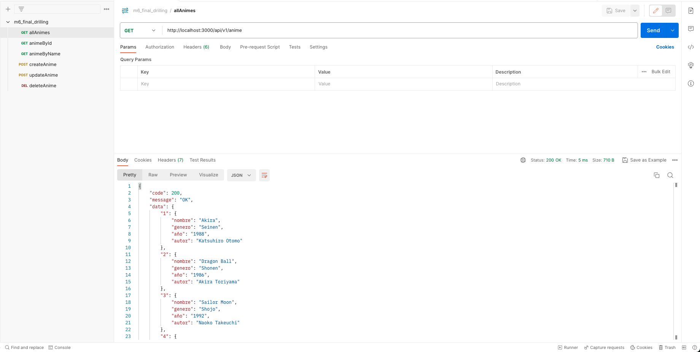
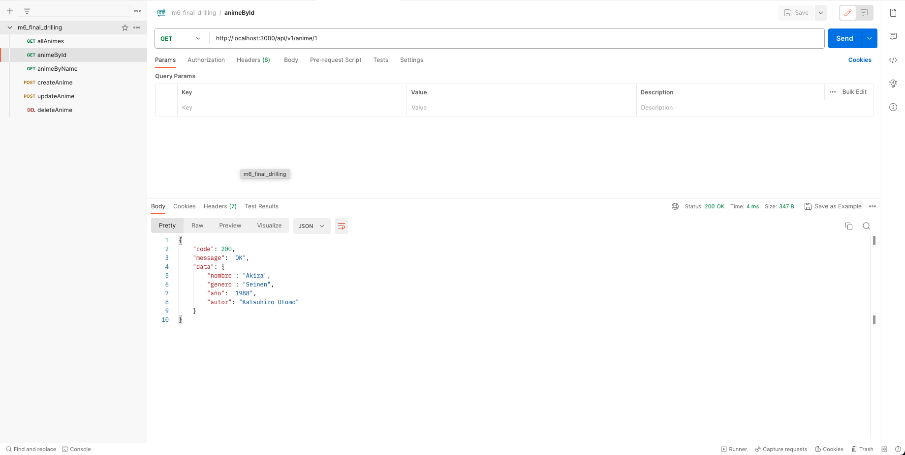
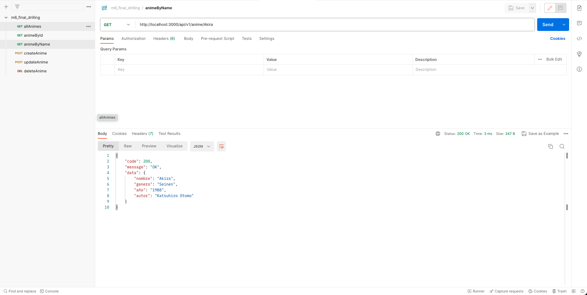
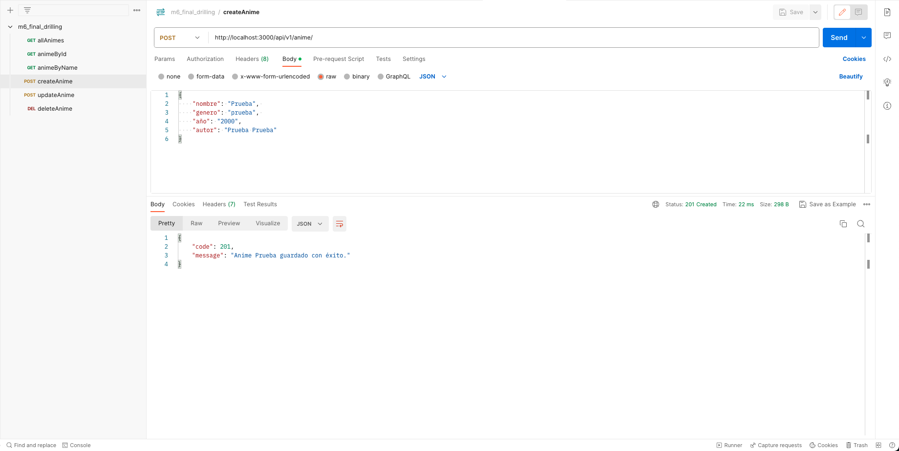
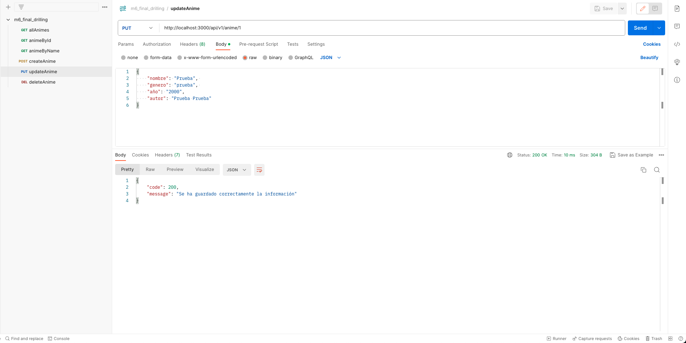
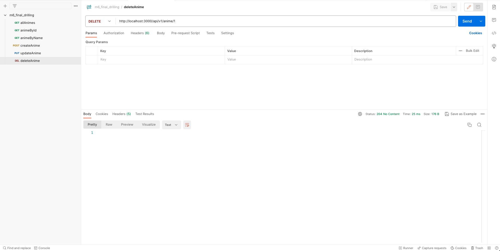

# Final Drilling

- Para usar el proyecto debe instalar las dependencias: `npm install`

- Una vez instalandas las dependencias podrá correr el servidor: `npm run dev`. Las rutas son las siguientes (Tambien puede realizar todas las consultas mencionadas usando el archivo de postman: m6_final_drilling.postman_collection)

  - Ver todos los animes: GET http://localhost:3000/api/v1/anime
  - Ver anime por ID: GET http://localhost:3000/api/v1/anime/:id
  - Ver anime por Nombre: GET http://localhost:3000/api/v1/anime/:name
  - Crear anime: POST http://localhost:3000/api/v1/anime/
  - Modificar anime: PUT http://localhost:3000/api/v1/anime/:id
  - Eliminar anime: PUT http://localhost:3000/api/v1/anime/:id

- Una vez instalandas las dependencias podrá correr las pruebas: `npm run dev`. Las pruebas son las siguientes:

  - Ver todos los animes: `npm run test tests/apiGet.test.js`
  - Ver anime por ID: `npm run test tests/apiGetId.test.js`
  - Ver anime por Nombre: `npm run test tests/apiGetNombre.test.js`
  - Crear anime: `npm run test tests/apiPost.test.js`
  - Modificar anime: `npm run test tests/apiPutId.test.js`

- Tambien puede ver los resultados de las consultas en la carpeta consultas:
  - Ver todos los animes 
  - Ver anime por ID 
  - Ver anime por Nombre 
  - Crear anime 
  - Modificar anime 
  - Eliminar anime 
